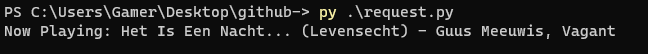

# PicoW-Spotify-Api Project

Dit project is geschreven in Python 3.10

Voor mijn keuzedeel Verdieping Software heb ik ervoor gekozen om een Raspberry Pi Pico W te gebruiken als een [Car Thing](https://carthing.spotify.com) van Spotify.

Vanaf januari anno 2023 krijgt de Pico W Bluetooth support, wat ik ga gebruiken om de Pico met een telefoon/tablet te verbinden.

Output van het script: "print(f"Now Playing: {cur_song} - {artists}"[:-2]}")

